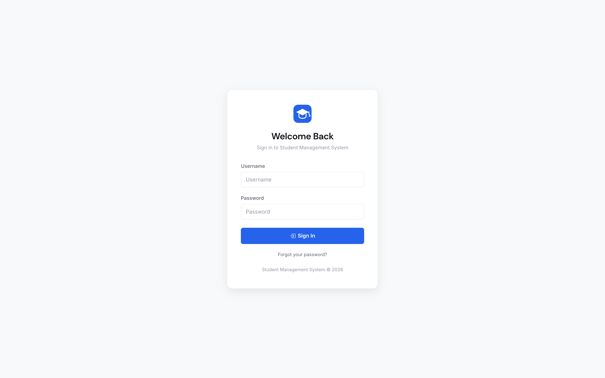
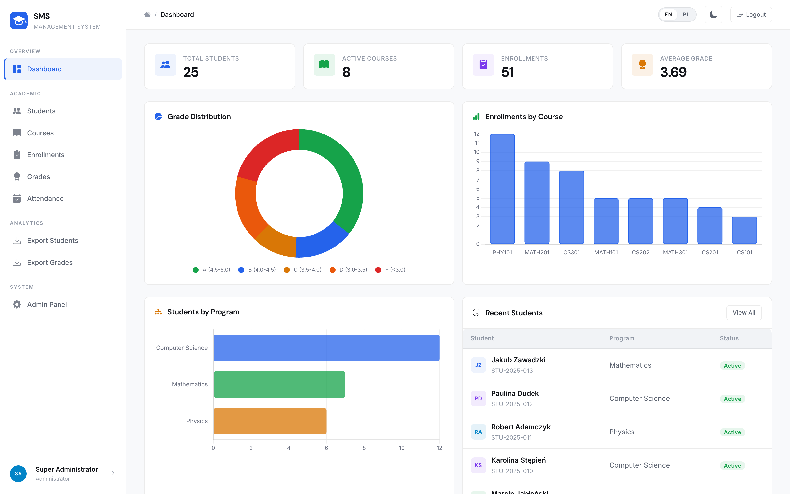
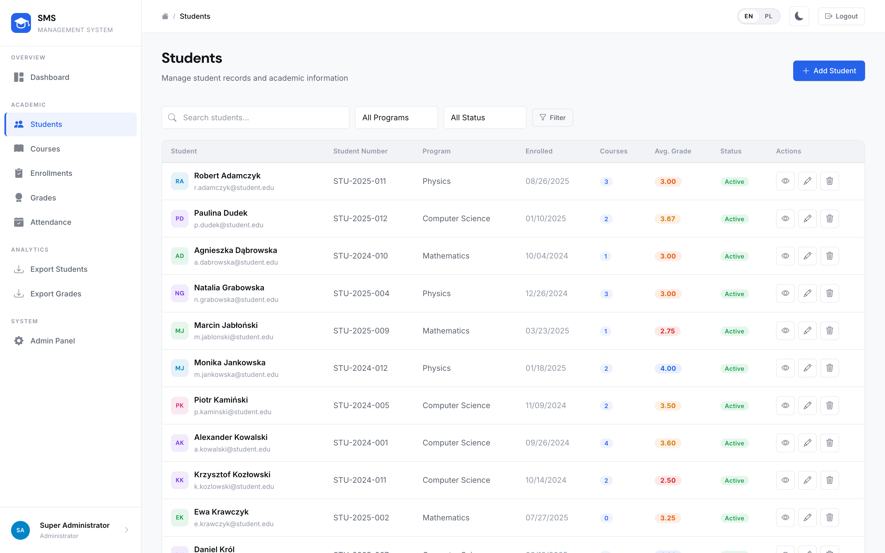
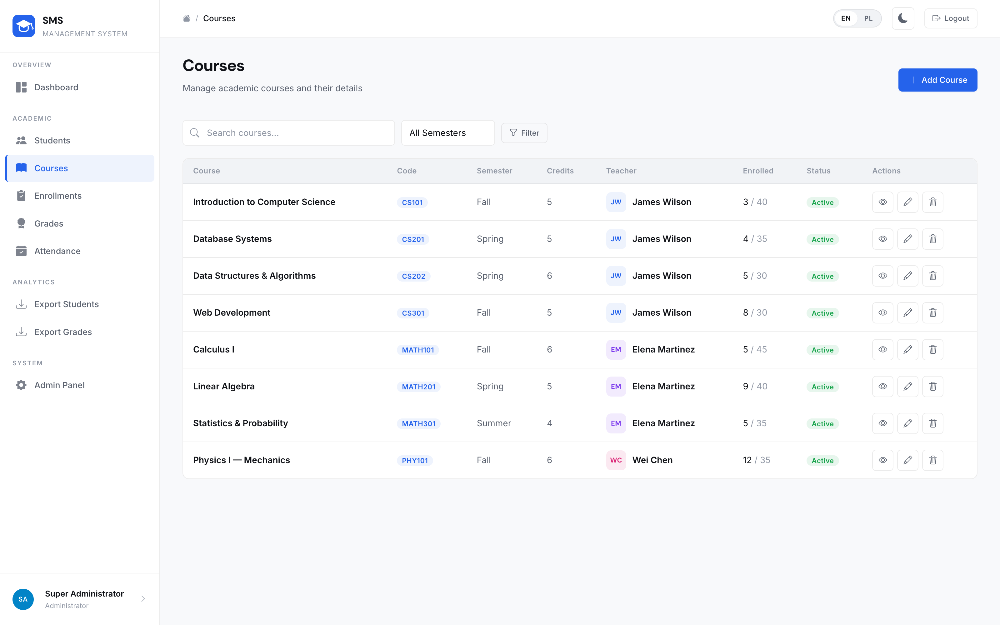
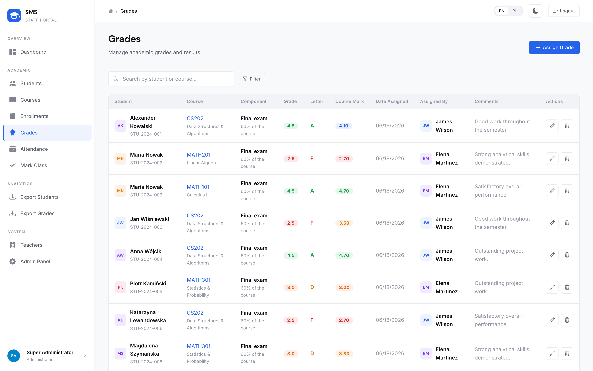
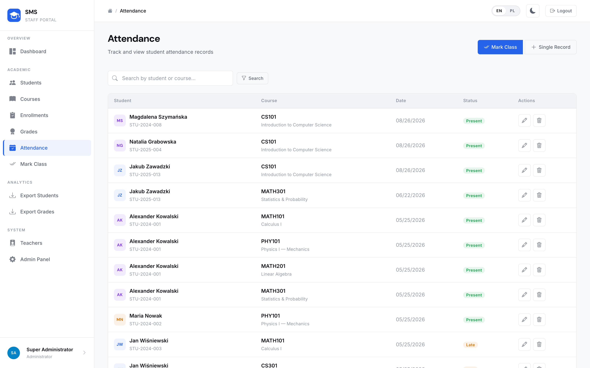
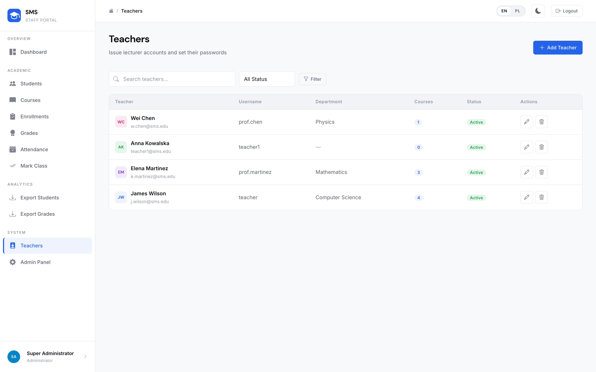
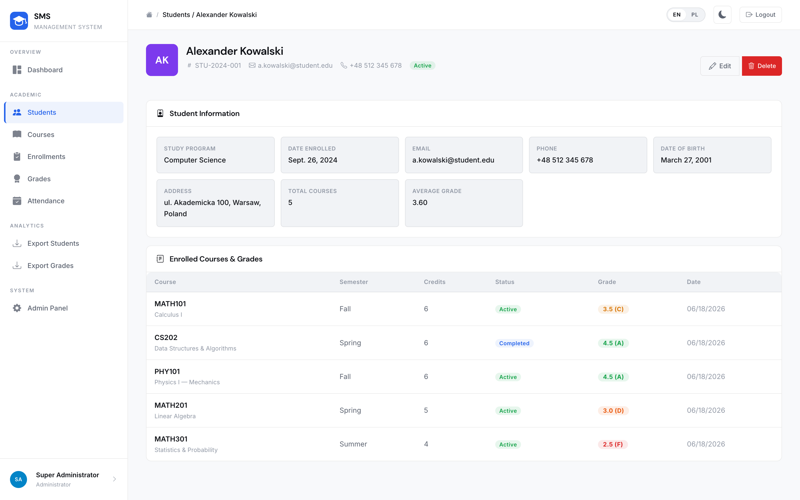

School of Computer Science & Technologies
Field of study: Computer Science

Maksym Shpak

Design and Implementation of a Web-Based Student Management System for Educational Institutions

Documentation for the diploma project
prepared under the direction of
Marcin Kacprowicz


Warsaw, 2026 r.


# 1. Basic information

Project name
Design and Implementation of a Web-Based Student Management System for Educational Institutions — Student Management System (SMS)
Purpose of the project
The project addresses a recurring problem in small and medium educational units: academic records for students, courses, grades and attendance are still often kept in spreadsheets or fragmented paper files. This leads to duplicated data, weak access control, and slow reporting for teachers and administrators. SMS centralises these processes in a single web application with role-based access (Administrator, Teacher), structured CRUD workflows, dashboard analytics, CSV export. Staff accounts are created by an administrator (there is no public registration). Students are records in the system, not user accounts. The system is implemented as a complete engineering deliverable — not only a conceptual design.
Brief description of the project
Student Management System is a full-stack Django web application that stores and manages academic data related to students, courses, enrolments, grades and attendance. Administrators maintain the institutional catalogue of students and courses; teachers manage grades and attendance for their own courses; students are academic records, not login accounts. The presentation layer uses Django templates with custom CSS and JavaScript; the application layer implements business rules and RBAC; the data layer uses a relational schema (SQLite locally, PostgreSQL in production via DATABASE_URL). The application is live at https://thesms.me (Render backup: https://diploma-project-sms-management-system.onrender.com).
Competitor analysis
Microsoft Excel / Google Sheets: easy to start, but no relational integrity, no role-based permissions, and high risk of accidental edits. Moodle / Canvas: powerful LMS platforms with many modules, but heavy to deploy and operate for a small faculty office that only needs student-course-grade-attendance administration. Commercial university ERP suites: broad feature sets and high cost, often oversized for training centres or single departments. SMS differentiator: a lightweight, open academic engineering project focused on core administrative workflows, transparent Django architecture suitable for defence and further extension, zero proprietary licence fees, and explicit teacher-centred dashboards with JSON analytics API.
List of technologies used
Backend:
Python 3.12, Django 6, Django Auth (session-based), Gunicorn, WhiteNoise, dj-database-url, PostgreSQL (production) / SQLite (development)
Frontend:
Django Templates, HTML5, CSS custom properties, vanilla JavaScript, Chart.js, Turbo, Bootstrap Icons, dashboard JSON endpoint (/api/dashboard/)
Infrastructure:
Render + Neon (build.sh: migrate + collectstatic + seed_demo), English/Polish i18n, HTTPS-oriented security settings when DEBUG=False, live at https://thesms.me (Render backup: https://diploma-project-sms-management-system.onrender.com)
Description of the technology stack and justification of selected technologies
The stack follows a classic three-tier architecture: Browser (HTML/CSS/JS) → Django views & forms (business logic, authentication, RBAC) → Relational database. Django was selected because it provides batteries-included authentication, CSRF protection, ORM migrations, and a dedicated Teachers screen for issuing lecturer accounts — essential for an academic records system delivered within an engineering diploma timeframe. Session authentication fits server-rendered pages better than JWT (no separate SPA). PostgreSQL is preferred in production for ACID transactions and concurrent multi-user access; SQLite keeps local development simple. WhiteNoise serves compressed static assets behind Gunicorn, which matches typical PaaS deployments without a separate Nginx container. There is no public registration: an administrator creates teacher accounts and issues credentials. The Teachers screen inside SMS is used to set a forgotten password, which matches a faculty-office workflow better than self-service email recovery.

# 2. Key issues related to the implementation of the project


## 2.1 Role-Based Access Control (RBAC)

The custom User model extends AbstractUser with a role field (admin / teacher). View decorators enforce permissions: administrators manage all records; teachers see only students, grades and attendance related to their own courses. A guessed URL outside that scope returns 404. Students are not users — they have no login. This prevents privilege escalation while keeping URLs simple.
Code snippet (decorator, simplified):
def role_required(allowed_roles):
    def decorator(view_func):
        def wrapper(request, *args, **kwargs):
            if request.user.role not in allowed_roles:
                return redirect('dashboard')
            return view_func(request, *args, **kwargs)
        return wrapper
    return decorator

## 2.2 Relational Academic Schema

The schema comprises six core models: User, Student, Course, Enrollment, Grade, Attendance. Enrolment links students and courses (many-to-many with status). A Grade is one weighted component of an enrolment (coursework, midterm, final exam or retake); Enrollment.final_grade is their weighted mean on the 2.0–5.0 scale with letter mapping, and assigned_by records which teacher last saved the mark. Attendance is unique per (enrolment, date). Foreign keys and unique constraints protect referential integrity at the database level.

**Where the integrity lives (core/models.py):**

```python
class Enrollment(models.Model):
    class Meta:
        unique_together = ['student', 'course']

class Attendance(models.Model):
    date = models.DateField(default=timezone.now)
    status = models.CharField(max_length=10, choices=STATUS_CHOICES,
                              default='present')
    class Meta:
        unique_together = ['enrollment', 'date']
```

Both rules are declared in the schema rather than checked in a view, so no path can break them: not the bulk marking screen, not the single-record form, not the Django admin and not a direct SQL insert. A student cannot be enrolled on the same course twice, and a class cannot be marked twice for the same day.

## 2.3 Dashboard Analytics and REST JSON Endpoint

The HTML dashboard aggregates KPIs (students, courses, enrolments, average grade) and chart series (grade distribution, enrolments per course). The page itself is server-rendered: both the tiles and the chart series arrive in the HTML, so no request is needed before the dashboard is readable. Endpoint GET /api/dashboard/ exposes the same figures as JSON for external clients. Both call one function, dashboard_metrics(), which applies the role scoping, so the two views of the data cannot drift apart.
Example response fields:
{'role': 'teacher', 'total_students': …, 'grade_distribution': {'A': …}, 'course_labels': [...], 'course_data': [...]}

## 2.4 Staff Account Provisioning

The application has no public registration. An administrator creates teacher accounts (username, role, initial password) on the Teachers screen inside SMS and issues those credentials out of band. Lecturers sign in with the issued username and password; students are data records, not users. If a teacher forgets a password, the administrator sets a new one on that same screen. This matches the real workflow of a faculty office and avoids an email-based recovery flow that would be unused without self-service sign-up.

## 2.5 Production Configuration and Security Hardening

Configuration is driven by environment variables: SECRET_KEY, DEBUG, ALLOWED_HOSTS, DATABASE_URL, DJANGO_ADMIN_PASSWORD. When DEBUG=False the application enforces HTTPS redirects, secure cookies, HSTS, and refuses insecure default SECRET_KEY values. DJANGO_ADMIN_PASSWORD replaces the published demo password on the admin account at deploy time, so that password is not left on the public internet. WhiteNoise serves hashed/compressed static files. This allows the same codebase to run locally on SQLite and on a hosted PostgreSQL instance without code changes. The public service is https://thesms.me (Render backup: https://diploma-project-sms-management-system.onrender.com). A live demonstration uses the teacher account prof.martinez / demo1234; a second teacher, prof.chen / demo1234, shows that each lecturer sees only their own courses.

**The deployment refuses to start insecurely (sms_project/settings.py):**

```python
if not DEBUG:
    if SECRET_KEY.startswith('django-insecure'):
        raise ValueError(
            'SECRET_KEY must be set via environment variable in '
            'production (DEBUG=False).'
        )
```

The development key that ships in the repository cannot reach production: with DEBUG off the process raises on startup rather than serving requests signed with a published secret. The same block enables HTTPS redirection, HSTS and secure cookies, so the hardened configuration is one decision rather than a checklist someone has to remember.

## 2.6 Internationalisation (English / Polish)

The interface is bilingual. Templates, model choices, flash messages and CSV headers go through Django i18n. The language switch keeps the current page and stores the choice in the django_language cookie, which LocaleMiddleware reads on every request. The compiled Polish catalogue (django.mo) is committed so the deploy image does not depend on gettext. LocalizationTests guard that English and Polish pages actually differ, and TranslationCatalogueTests fail on any fuzzy or untranslated entry, because msgfmt drops fuzzy messages and they would ship as English.

## 2.7 Bulk Attendance Marking

Attendance is the highest-volume operation in the system: a lecturer records a status for every student in a group after every class. Marking students one at a time would mean a separate form submission per student, so the Mark Class screen loads the whole roster for a chosen course and date and saves it in a single POST. Quick actions set the entire group to present, absent or late before individual corrections. The view iterates the submitted statuses and uses update_or_create per enrolment, so re-marking the same class corrects the existing rows instead of duplicating them. "Not marked" is treated as a deliberate state rather than a missing one: choosing it removes the stored record, so the screen keeps telling the truth about that date.

Correctness does not rest on the interface. Attendance carries a unique constraint on (enrollment, date) in the schema, so a second record for the same student on the same day cannot be created by any path — the bulk screen, the single-record form, the Django admin or a direct SQL insert. A teacher may only load rosters for courses they teach, enforced by the same queryset scoping as the rest of the application. BulkAttendanceTests cover the group save, a repeated save against the unique rule, clearing a record, the pre-selected roster, active enrolments only, an unparsable date falling back to today, and a teacher trying to read or mark a colleague's course.

**A whole roster in one request (core/views.py):**

```python
for enrollment in enrollments:
    choice = request.POST.get(f'status_{enrollment.pk}')
    if choice in {'present', 'absent', 'late'}:
        Attendance.objects.update_or_create(
            enrollment=enrollment, date=selected_date,
            defaults={'status': choice},
        )
    elif choice == 'none' and enrollment.pk in existing:
        existing[enrollment.pk].delete()
```

update_or_create is what makes a second marking of the same class a correction instead of a collision with the unique rule above. The final branch treats "not marked" as a deliberate answer rather than a missing one: it removes the stored row, so the screen keeps telling the truth about that date.

# 3. Screenshots, visualizations, etc.

The figures below are captures of the running Student Management System (local interface, English locale, light theme unless noted).



*Fig. 1 — Login page. Accounts are issued by an administrator; there is no public registration.*



*Fig. 2 — Administrator dashboard: KPI tiles and Chart.js analytics.*



*Fig. 3 — Student register with search, programme and status filters.*



*Fig. 4 — Course catalogue: code, semester, teacher assignment and capacity.*



*Fig. 5 — Grade register: weighted components, letter bands and the teacher who saved the mark.*



*Fig. 6 — Attendance register with present / absent / late statuses.*



*Fig. 7 — Teachers screen: the administrator issues lecturer accounts and can set a new password.*



*Fig. 8 — Student profile: enrolments, grades and attendance in one view.*

# 4. Conclusions and development prospects

The primary goal — to design and implement a functional web-based Student Management System for educational administration — was achieved. The application covers authentication with RBAC, student and course administration, enrolments, weighted grade components, bulk attendance marking, a bilingual EN/PL interface, analytics dashboard, CSV export, and production-oriented configuration.
All core objectives were met:
- Role-based access for Administrator and Teacher (students are records, not users)
- Relational schema with integrity constraints for academic entities
- CRUD workflows with form validation and flash messages
- Weighted grade components, authorship audit, bulk class attendance
- Dashboard KPIs and role-scoped REST endpoint /api/dashboard/
- Bilingual interface (English / Polish, 312 translatable strings)
- Staff accounts provisioned by an administrator (no public registration)
- Automated test suite (111 tests) covering models, auth, API and CRUD
- Deployment-ready settings (Gunicorn, WhiteNoise, Postgres via DATABASE_URL)
The project demonstrates that a production-capable academic administration system can be delivered by a single developer within an engineering diploma timeframe, using a coherent Django monolith suitable for oral examination and further maintenance.
Future development priorities:
- Student portal — a third role with read-only access to own results
- PDF report generation for transcripts and attendance sheets
- Email notifications on new grades and absences
- Documented REST API with token authentication for mobile clients
- Two-factor login (TOTP) for administrator accounts
- Timetabling with room and slot conflict detection

# 5. Bibliography / Resources

Official Documentation
[1] Django Software Foundation — Django Documentation — https://docs.djangoproject.com
[2] Django Software Foundation — Django Authentication System — https://docs.djangoproject.com/en/stable/topics/auth/
[3] Python Software Foundation — Python 3 Documentation — https://docs.python.org/3/
[4] The PostgreSQL Global Development Group — PostgreSQL Documentation — https://www.postgresql.org/docs/
[5] SQLite Consortium — SQLite Documentation — https://www.sqlite.org/docs.html
[6] Whitenoise — WhiteNoise Documentation — https://whitenoise.readthedocs.io
[7] Gunicorn — Gunicorn Documentation — https://docs.gunicorn.org
[8] Render — Deploy Django — https://render.com/docs/deploy-django
[9] MDN Web Docs — HTML / CSS / HTTP — https://developer.mozilla.org
[10] OWASP Foundation — OWASP Top Ten — https://owasp.org/www-project-top-ten/
[11] Jazzband — dj-database-url — https://github.com/jazzband/dj-database-url
[12] Bootstrap Icons — https://icons.getbootstrap.com
[13] Uniwersytet VIZJA / AEH — study programme materials for Computer Science (engineering profile)

**Platforms compared in section 1**

[14] Moodle — Moodle Docs (attendance is the contributed mod_attendance plugin) — https://docs.moodle.org
[15] MUCI — USOS, the university study service system used by Polish public HEIs — https://www.usos.edu.pl
[16] Google — Classroom Help Centre — https://support.google.com/edu/classroom